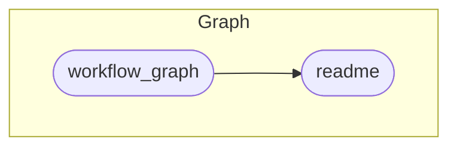

<!-- README.md is generated from README.qmd. Please edit that file -->

# Data Visualization with R <a href='https://econs23.classes.andrewheiss.com/'></a>

[PMAP 8101 • Summer 2023](https://datavizs23.classes.andrewheiss.com/)  
[Andrew Heiss](https://www.andrewheiss.com/) • Andrew Young School of
Policy Studies • Georgia State University

------------------------------------------------------------------------

**[Quarto](https://quarto.org/) +
[{targets}](https://docs.ropensci.org/targets/) +
[{renv}](https://rstudio.github.io/renv/) = magic! 🪄**

------------------------------------------------------------------------

## How to build the site

1.  Install
    [RStudio](https://www.rstudio.com/products/rstudio/download/#download)
    version 2022.07.1 or later since it has a
    [Quarto](https://quarto.org/) installation embedded in it.
    Otherwise, download and install [Quarto](https://quarto.org/)
    separately.
2.  Open `compasp23.Rproj` to open an [RStudio
    Project](https://r4ds.had.co.nz/workflow-projects.html).
3.  If it’s not installed already, R *should* try to install the [{renv}
    package](https://rstudio.github.io/renv/) when you open the RStudio
    Project for the first time. If you don’t see a message about package
    installation, install it yourself by running
    `install.packages("renv")` in the R console.
4.  Run `renv::restore()` in the R console to install all the required
    packages for this project.
5.  Run `targets::tar_make()` in the R console to build everything.
6.  🎉 All done! 🎉 The complete website will be in a folder named
    `_site/`.

## {targets} pipeline

I use the [{targets} package](https://docs.ropensci.org/targets/) to
build this site and all its supporting files. The complete pipeline is
defined in [`_targets.R`](_targets.R) and can be run in the R console
with:

``` r
targets::tar_make()
```

The pipeline does several major tasks:

- **Build Quarto website**: This project is a [Quarto
  website](https://quarto.org/docs/websites/), which compiles and
  stitches together all the `.qmd` files in this project based on the
  settings in [`_quarto.yml`](_quarto.yml). See the [Quarto website
  documentation](https://quarto.org/docs/websites/) for more details.

- **Upload resulting `_site/` folder to my remote server**: Quarto
  places the compiled website in a folder named `/_site/`. The pipeline
  uses `rsync` to upload this folder to my personal remote server. This
  target will only run if the `UPLOAD_WEBSITES` environment variable is
  set to `TRUE`, and it will only work if you have an SSH key set up on
  my personal server, which only I do.

The complete pipeline looks like this:

<small>(This uses [`mermaid.js`
syntax](https://mermaid-js.github.io/mermaid/) and should display as a
graph on GitHub. You can also view it by pasting the code into
<https://mermaid.live>.)</small>



## Fonts and colors

The fonts used throughout the site are [Fira Sans
Condensed](https://fonts.google.com/specimen/Fira+Sans+Condensed) and
[Barlow](https://fonts.google.com/specimen/Barlow).

The colors for the site and hex logo come from the
[plasma](https://cran.r-project.org/web/packages/viridis/vignettes/intro-to-viridis.html#the-color-scales)
color scale from the viridis color maps:

``` r
viridisLite::viridis(8, option = "plasma", begin = 0.1, end = 0.9)
```


## Licenses

**Text and figures:** All prose and images are licensed under Creative
Commons ([CC-BY-NC
4.0](https://creativecommons.org/licenses/by-nc/4.0/))

**Code:** All code is licensed under the [MIT License](LICENSE.md).
